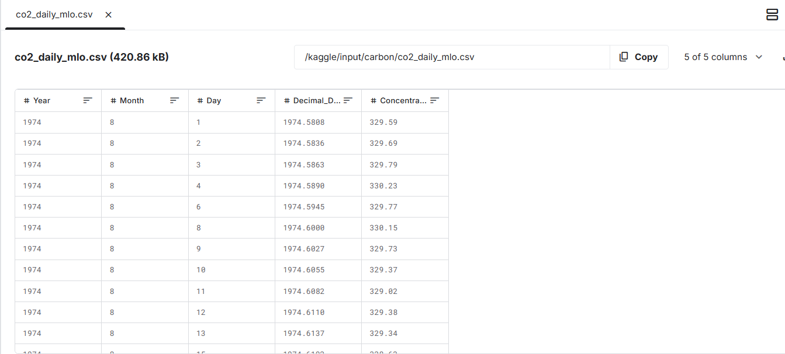

# Carbon Dioxide Level Prediction Model

## Overview

This Kaggle notebook presents a machine learning model that predicts atmospheric CO₂ concentration levels for the next 7 days based on historical data. The model uses time series forecasting techniques to analyze patterns in carbon dioxide measurements and make future projections.

## Data Collection

### Source

The data was manually collected from the NOAA Earth System Research Laboratory (ESRL) website, specifically from their Global Monitoring Laboratory, which provides free access to atmospheric CO₂ measurements from the Mauna Loa Observatory in Hawaii. This is one of the most authoritative sources for atmospheric CO₂ data.

### Data Structure

The dataset (`co2_daily_mlo.csv`) contains daily CO₂ concentration measurements with the following columns:

- **Year**: The year of measurement
- **Month**: The month of measurement
- **Day**: The day of measurement
- **Decimal_Date**: The date in decimal format (for precise time representation)
- **Concentration**: CO₂ concentration in parts per million (ppm)



## Data Preprocessing

Key preprocessing steps included:

- **Removing unnecessary columns**: The `Decimal_Date` column was dropped as we can reconstruct dates from the `Year`, `Month`, and `Day` columns.
- **Date formatting**: Created a proper datetime column (`ds`) from the `Year`, `Month`, and `Day` columns to work with time series models.
- **Renaming columns**: The target variable (CO₂ concentration) was renamed to `y` to follow Prophet's naming conventions.
- **Handling missing values**: The dataset appeared complete, but Prophet (the chosen model) can handle missing values if present.

## Model Selection and Implementation

### Models Considered

- **ARIMA (AutoRegressive Integrated Moving Average)**:
  - Traditional time series model
  - Requires stationary data (differencing needed)
  - Manual parameter tuning required
  - Didn't capture seasonality patterns well
- **LSTM (Long Short-Term Memory)**:
  - Deep learning approach good for sequence prediction
  - Requires more data and computational resources
  - Harder to interpret than Prophet
- **Facebook's Prophet**:
  - Specifically designed for time series forecasting
  - Handles seasonality and holidays automatically
  - Provides intuitive parameters
  - Robust to missing data and outliers
  - Produces uncertainty intervals

### Why Prophet Was Chosen

The Prophet model was selected because:

- It's optimized for forecasting problems with daily observations
- Automatically detects seasonal patterns (important for CO₂ which has annual cycles)
- Provides interpretable parameters and components
- Handles missing data well
- Produces probabilistic forecasts with uncertainty intervals
- Requires less parameter tuning than ARIMA
- More computationally efficient than LSTM for this use case

### Prophet Model Implementation

The model was implemented with these key parameters:

```python
seasonality_mode='multiplicative',  # Better for growing trends
yearly_seasonality=True,           # Capture annual CO₂ cycles
weekly_seasonality=False,          # No significant weekly pattern
daily_seasonality=False            # No significant daily pattern
```

Key steps:

1. Initialize the Prophet model with appropriate seasonality settings
2. Fit the model on historical CO₂ data
3. Create a future dataframe for 7 days of predictions
4. Generate forecasts including uncertainty intervals
5. Visualize the results and model components

## Results and Interpretation

The model produces:

- A trend line showing the overall increase in CO₂ levels
- Yearly seasonal components showing the periodic fluctuations
- Uncertainty intervals around predictions

The visualization shows:

- The historical data points (black dots)
- The fitted model (blue line)
- Future predictions with uncertainty ranges (light blue shaded area)

The model successfully captures:

- The long-term upward trend in atmospheric CO₂
- The annual seasonal cycle (higher in winter, lower in summer)
- The accelerating rate of increase in recent years
