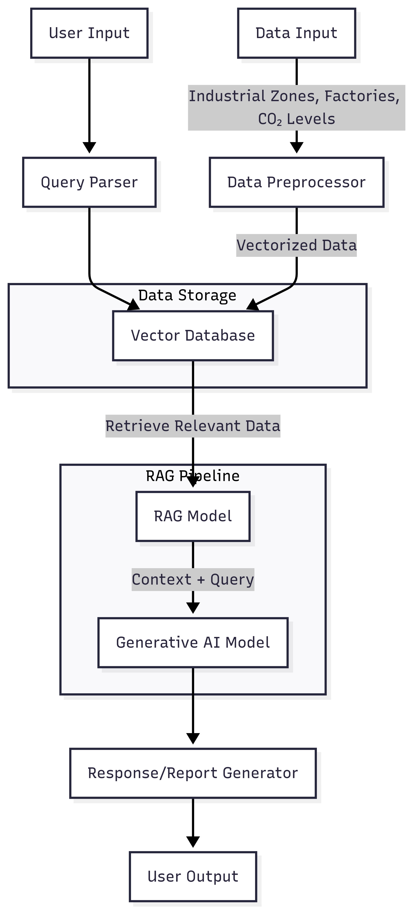

# RAG-Based Chatbot for Industrial Zone and Carbon Level Analysis

## Overview

This project implements a Retrieval-Augmented Generation (RAG) chatbot to answer queries and generate reports on industrial zones, factories, and CO₂ levels. It collects data, stores it in a vector database, and uses RAG to provide accurate responses based on user questions.

## System Description

The chatbot uses a RAG pipeline to:

- **Ingest**: Collect industrial zone, factory, and CO₂ data.
- **Store**: Save data as vector embeddings in a database (e.g., Pinecone, FAISS).
- **Query**: Retrieve relevant data and generate answers or reports using a generative AI model.
- **Analyze**: Provide insights like emission trends or factory compliance.

## System Architecture

## Workflow

1. **Data Input**: Industrial zones (location, type), factories (production, emissions), CO₂ levels (ppm, timestamp).
2. **Preprocessor**: Converts data into vector embeddings.
3. **Vector Database**: Stores embeddings for fast retrieval.
4. **Query Parser**: Extracts intent from user queries.
5. **RAG Model**: Retrieves relevant data and feeds it to the generative AI.
6. **Generative AI**: Produces answers or reports.
7. **Output**: Delivers responses or formatted reports.

## Data Structure

- **Industrial Zones**: Location, size, type.
- **Factories**: Name, production type, emissions.
- **CO₂ Levels**: Concentration (ppm), timestamp, location.

## Query Examples

- "CO₂ trends for Factory X in 2024?" → Retrieves 2024 data, generates trend report.
- "Factories in Zone A exceeding emissions?" → Lists non-compliant factories.
