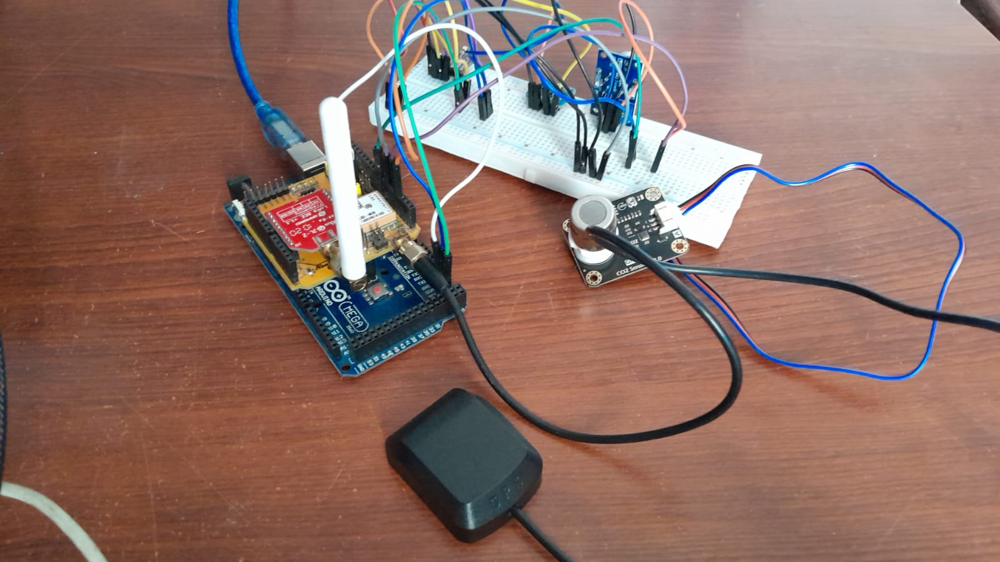
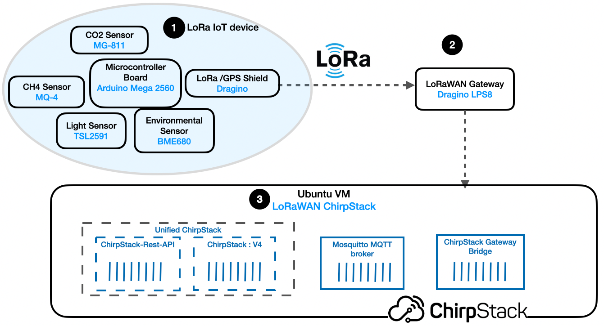
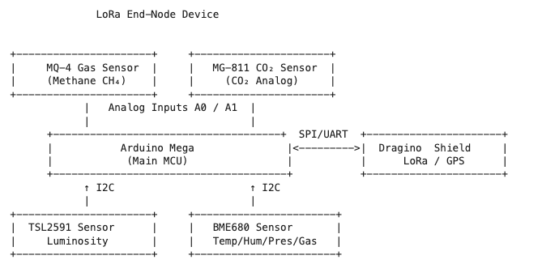

# An IoT-Based System to Measure Methane and Carbon Dioxide Emissions Along with Temperature and Humidity in Industrial Sites

## Overview

The IoT system collects real-time environmental data and communicates through a LoRaWAN gateway to a ChirpStack network server.

The collected data includes:
- Atmospheric metrics (temperature, humidity, pressure)
- Gas concentrations (CO₂ and CH₄)
- Light intensity
- GPS location

## Architecture Overview

The IoT system is composed of three main components:

1. The LoRa End Node
2. The LoRaWAN Gateway
3. The Network Stack: ChirpStack

## Hardware Setup

### Conceptual Block Diagram

### Pinout Tables

#### Dragino LoRa GPS Shield

| Component         | Dragino LoRa GPS Shield                                           |
|-------------------|--------------------------------------------------------------------|
| Output            | GPS (Longitude, Latitude)                                         |
| Interface         | SPI / UART                                                        |
| Arduino Mega Pins | SPI: 10 (NSS), 9 (RST), 2 (DIO0), 6 (DIO1), 7 (DIO2) UART: 18 (TX1), 19 (RX1) |

#### MQ-4

| Component         | MQ-4                   |
|-------------------|------------------------|
| Output            | Methane (CH₄)          |
| Interface         | Analog                 |
| Arduino Mega Pins | A0                     |
| Power             | VCC (5V), GND          |

#### MG-811

| Component         | MG-811                  |
|-------------------|-------------------------|
| Output            | Carbon Dioxide (CO₂)    |
| Interface         | Analog                  |
| Arduino Mega Pins | A1                      |
| Power             | VCC (9V, External), GND |

#### BME680

| Component         | BME680                                 |
|-------------------|----------------------------------------|
| Outputs           | Temperature, Humidity, Pressure       |
| Interface         | I2C                                    |
| Arduino Mega Pins | SDA: 20, SCL: 21                       |
| Power             | VCC (3.3V), GND                       |

#### TSL2591

| Component         | TSL2591                  |
|-------------------|--------------------------|
| Output            | Luminosity               |
| Interface         | I2C                      |
| Arduino Mega Pins | SDA: 20, SCL: 21         |
| Power             | VCC (3.3V), GND          |

## Main Features

The IoT system is designed for robust, low-power environmental monitoring using LoRaWAN and a modular network stack.

**End Node Features:**
- Built on Arduino Mega for expanded memory and I/O capability.
- Dragino LoRa/GPS Shield for LoRaWAN and GPS.
- Supports LoRaWAN OTAA for secure device registration.
- CayenneLPP payload encoding.
- Sensors:
  - MG-811 (CO₂ gas sensor)
  - MQ-4 (CH₄ gas sensor)
  - BME680 (Temperature, Humidity, Pressure)
  - TSL2591 (Light intensity)

**LoRa Gateway Features:**
- Dragino LPS8 LoRaWAN Gateway.
- Receives packets on 868 MHz band.
- Uses Semtech UDP packet forwarder.

**Network Stack (ChirpStack):**
- ChirpStack Docker Compose (V4) from [brocaar/chirpstack-docker](https://github.com/brocaar/chirpstack-docker).
- Services:
  - chirpstack
  - chirpstack-gateway-bridge-eu868
  - chirpstack-rest-api
  - postgres
  - redis
  - mosquitto

## Payload Mapping (CayenneLPP)

- Cayenne LPP coding is used to send data payloads.
- Sensor data fields:

| Channel | Sensor/Data Type            |
|---------|-----------------------------|
| 1       | GPS (lat, lon, alt)         |
| 2       | Temperature                 |
| 3       | Relative Humidity           |
| 4       | Barometric Pressure         |
| 5       | Luminosity (Light Lux)      |
| 6       | Analog Input (MQ-4 CH₄ ppm) |
| 7       | Analog Input (MG-811 CO₂ ppm)|

## Firmware

The `firmware/` folder contains the Arduino sketch for the end node.

### Required Libraries

| Sensor/Function | Library Used                           | Purpose                            |
|-----------------|----------------------------------------|------------------------------------|
| LoRaWAN (OTAA)  | lmic, hal                              | Join/send LoRa packets            |
| GPS             | TinyGPS                                 | Get latitude, longitude, altitude |
| Cayenne Payload | CayenneLPP                              | Encode sensor data                |
| I2C Interface   | Wire                                    | Communication with I2C sensors    |
| BME680          | Adafruit_BME680, Adafruit_Sensor      | Temp, humidity, pressure, gas     |
| TSL2591         | Adafruit_TSL2591, Adafruit_Sensor     | Light intensity                   |

### Firmware Features

- Initializes all I2C and analog sensors.
- Reads temperature, humidity, pressure, light, and gas concentrations.
- Parses GPS data over Serial1.
- Encodes payload using CayenneLPP.
- Sends data over LoRaWAN using OTAA.

