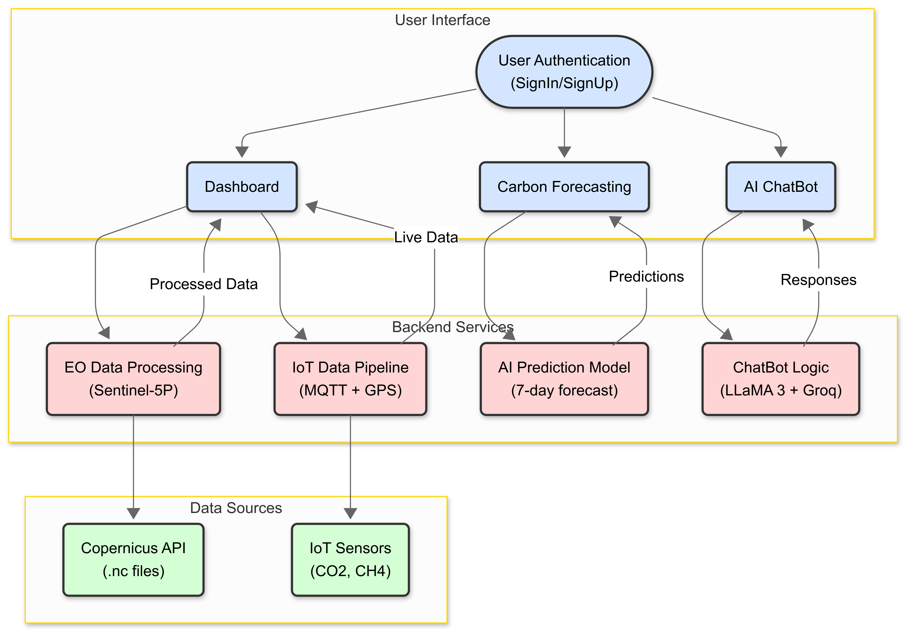

<div style="display: flex; justify-content: space-between; align-items: center;">
  <h1>CarbonSense </h1>
  
</div>


Carbonsense weaves IoT, AI, and Web into a vibrant platform for tracking Earth's air. Its sleek dashboard, AI chatbot, and 7-day gas forecasts empower users to monitor CO2, CH4, and more. Split into three GitHub repos—AI for analytics, IoT for sensors, and Web for UI/backend—it’s a bold step toward a greener future.


## IoT
  - Contains the IoT system description, firmware, and libraries.
## Web
### Frontend
  - Contains every service display for user ensuring a good UI & UX
### Backend
  - API : Contains AI forcasting and ChatBot functionalities
  - data : Contains data handling for EO
  - IoT : Contains scripts to link Iot device to the webapplication
## AI
  - ChatBot & AI forcasting 
  - Integrated in the web's backend : backend/API/views.py


## Architecture Diagram



The system monitors environmental gas concentrations ( CO, NO2, CH4, CO2...) using Earth Observation (EO) and IoT data, offering:

- Real-time dashboards for gas levels.
- AI-powered chatbot for analysis and queries.
- 7-day gas emission forecasts.
- AI Assistant

## Project Structure

The project is split into three GitHub repositories:

- **AI**: Powers chatbot and forecasting, integrated into the Web backend.
- **IoT**: Manages IoT firmware and real-time sensor data via MQTT.
- **Web**:
  - **Backend**: Handles APIs (SignUp/SignIn, chatbot, forecasting), EO data processing, and IoT integration using Django REST Framework.
  - **Frontend**: Displays interactive dashboards, chatbot UI, and forecasting visuals.

## Setup

1. Clone the repositories: **AI**, **IoT**, **Web**.

2. Configure `.env` with Copernicus and Groq API credentials.

3. Run with Docker Compose:

   ```bash
   docker-compose build
   docker-compose up
   ```

   - Frontend: `http://localhost:5173`
   - Backend: `http://localhost:8000`
