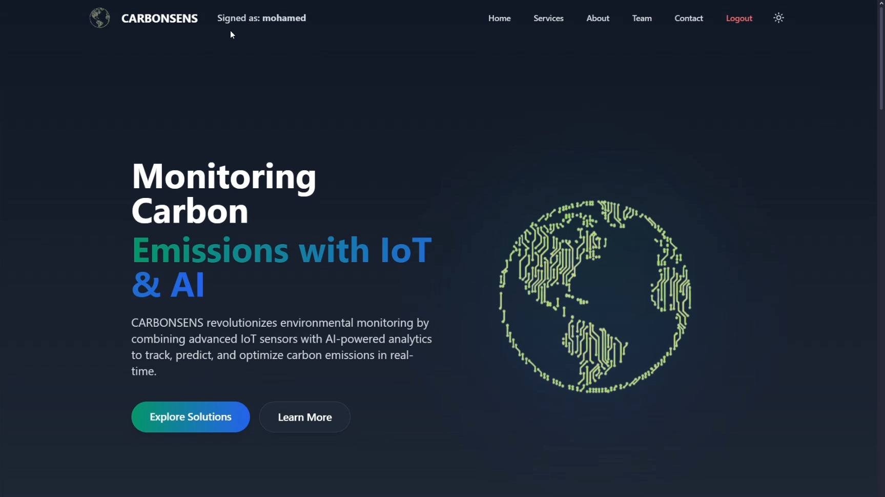

<h1 style="text-align: center;">
  CarbonSens: Monitoring Key Atmospheric Pollutants and Climate-Active Gases using IoT, EO and AI
</h1>


Carbonsens weaves IoT, AI, and Web into a vibrant platform for tracking Earth's air. Its sleek dashboard, AI chatbot, and 7-day gas forecasts empower users to monitor key atmospheric pollutants and climate-active gases like CO2, CH4, and more. Split into three GitHub repos—AI for analytics, IoT for sensors, and Web for UI/backend—it’s a bold step toward a greener future.

<p align="center"></p>
 

---

## 1. Project structure

```bash
├── AI            # ChatBot & AI forcasting
├── Documents     # Project documentation & images
├── IoT           # IoT system architecture and Arduino firmware  
├── Web           # Full-stack web application 
├── .gitignore    # specify which files git should ignore
├── README.md     # Project overview and setup instructions
└── CHANGELOG.md   # Version history and updates
```

 
### 1.1. AI
  - ChatBot & AI forcasting 
  - Integrated in the web's backend : backend/API/views.py

### 1.2. IoT   
  - The `iot/` folder includes the microcontroller code to:
     
     - Interface with sensors (BME680, MQ-4, MG811, TSL2591, GPS)
     - Package data using CayenneLPP
     - Send data over LoRaWAN using LMIC with OTAA

### 1.3. Web

#### Frontend

- Displays interactive dashboards, chatbot UI, and forecasting visuals.
- Contains every service display for user ensuring a good UI & UX
  
#### Backend 
- Handles APIs (SignUp/SignIn, chatbot, forecasting), EO data processing, and IoT integration using Django REST Framework.
  - API : Contains AI forcasting and ChatBot functionalities
  - data : Contains data handling for EO
  - IoT : Contains scripts to link Iot device to the webapplication

### 1.4. Documents

- project-related documentation and images

---

## 2. End-to-End Solution Architecture

The system monitors  gas concentrations ( CO, NO2, CH4, CO2...) using Earth Observation (EO) and IoT (Internet of Things) data, offering:

- Real-time dashboards for gas levels.
- AI-powered chatbot for analysis and queries.
- 7-day gas emission forecasts.
- AI Assistant

The following diagram provides a high-level overview of the complete system architecture, illustrating the interaction between the core components:

### 2.1. EO System
Earth Observation data, mainly from sentinel 5P imagery, is processed to compute gas concentrations for CO, CH4, NO2, O3 and  SO2
### 2.2. IoT System
Physical sensors deployed in the field collect environmental and gas concentration data. The data is transmitted via LoRa to a LoRaWAN Stack in a virtual server in the cloud. For a detailed view of the IoT system and its components, see the [IoT README](./IoT/README.md)
### 2.3. Web Application
Serves as the interface for users to visualize real-time sensor data, EO insights, and analytics.  For a detailed view of the web application's internal architecture, see the [Web README](./Web/README.md)


---

## 3. Setup

### 3.1. Clone the Repository

```bash
git clone https://github.com/zaydbf/GAIAthon.git
cd GAIAthon
```

### 3.2. Environment Configuration

Create & Configure `.env` with Copernicus, Groq API credentials and VM vAriables. (in Web/backend/.env)

Check `.env.exemple` for more details [.env.exemple](./Web/backend/.env.exemple)

### 3.3.  Build and Run


   ```bash
   docker-compose build
   docker-compose up
   ```

   - Frontend: `http://localhost:5173`
   - Backend: `http://localhost:8000`

---

## 4. Changelog

See [CHANGELOG.md](CHANGELOG.md) for detailed version history and updates.

