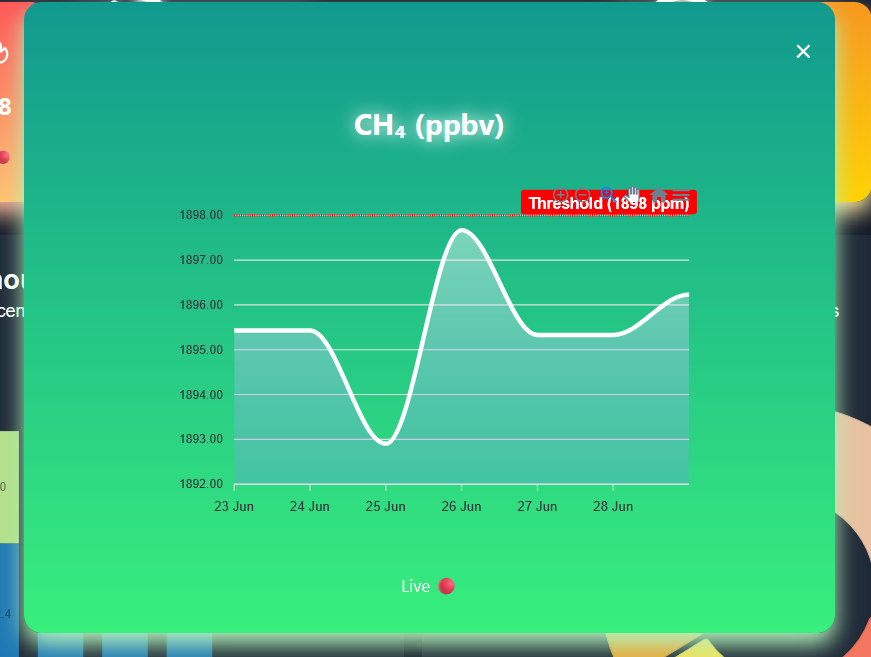
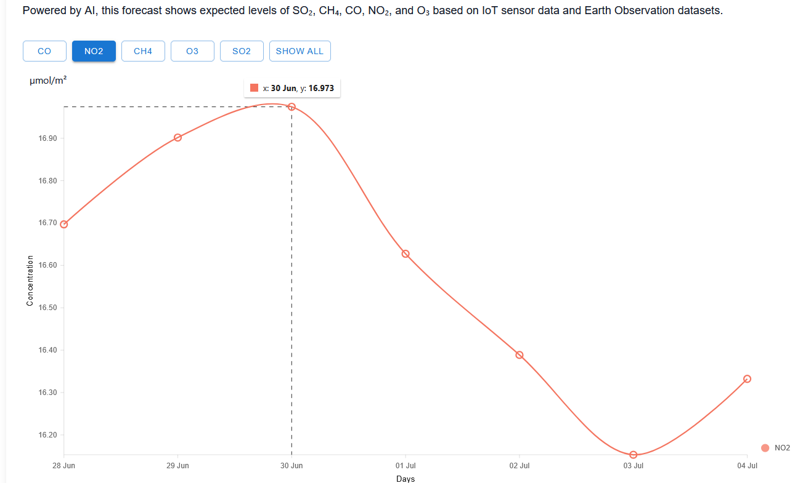

# Project Setup and Run Guide

This guide explains how to run the project using **Docker Compose** .Alternatively, you can use the manual setup process (requiring the use of requirements.txt and npm install).

---
##  Setup .env file (backend/.env)
  - Make a Copernicus account at : https://dataspace.copernicus.eu/
  - Get an API KEY from : https://console.groq.com/keys
Change the corresponding variables :
```bash
# ========== AI API KEY ========== #
GROQ_API_KEY=<API_KEY>

# ========== COPERNICUS CREDENTIALS ========== #
COPERNICUS_USERNAME=<COPERNICUS_EMAIL>
COPERNICUS_PASSWORD=<COPERNICUS_PASSWORD>

# ========== VIRTUAL MACHINE VARIABLES ========== #
MQTT_BROKER=<VIRTUAL_MACHINE_ADDRESS>
MQTT_PORT=<PORT_RUNNING_THE_SERVICE>
MQTT_TOPIC=<MQTT_TOPIC>
````

##  Run with  the existing Docker Compose 
Ensure that docker system is already installed on you pc  

### Build the Docker Images & start the containers
```bash
docker-compose build
docker-compose up
```
And everything  will run fine ( no need for further configurations )

The frontend will be available at http://localhost:5173
the backend will run at http://localhost:8000 .
You can modify the Dockerfiles and docker-compose.yml to suit your specific needs.

---
# Documentation And Project Overview

Here you can find a guide on the project's structure and each service it provides
## Backend

### API
The api app serves the Singup, Signin Logic, the Chat Bot logic and the AI prediction logic:

##### ChatBot
The application includes an AI-powered chatbot capable of two modes:
- **General Chat Mode**  
  The chatbot engages in natural conversation using a language model (LLaMA 3 via Groq). It uses previous messages to maintain context.
- **Analysis Mode**  
  When activated, users can upload CSV data (e.g., factory CO₂ levels), and the chatbot performs analysis such as:
  - Calculating average CO₂ levels  
  - Identifying the highest-emitting factory  
  - Warning if emissions exceed safe thresholds
 
The chatbot uses a carefully crafted default prompt to guide its responses based on CarbonSens project details and technical specs.

##### AI Gas Emission Prediction
This endpoint predicts gas concentration levels for the next 7 days based on recent measurements of the specified gas in the given region.

- **Parameters:**  
  - `gas`: The type of gas (e.g., CO, CH4)  
  - `region`: The target region name  

- **Response:**  
A JSON object with an array of predicted gas levels for the upcoming week.
### data
The Data app serves the integration of Earth Observation (EO) data
##### run_data.py script:
This script handles all the data logic as follows :
- **get_data Function:**
this function is located in backend/data/data/Sentinel_5p_Data_scripts/get_data.py which:
  - Defines Variables (username, password,nbr of images, area of interest ...)
  - Connects to COPERNICUS' Website
  - Gets EO Data and download .nc files (backend/data/data/data_sentinel_5p)
- **read_data Function:**
this function is located in backend/data/data/Sentinel_5p_Data_scripts/read_data.py which:
  - Reads .nc files
  - Converts .nc files to Pandas dataframe
  - Converts Pandas dataframe to CSV files (backend/data/data/CSV_data)
  - Plot the data to a map (for debugging) (backend/data/data/plot)
- **calculate_avg Function:**
this function is located in backend/data/data/calculate_avg.py which:
  - Reads CSV file
  - Calculates the average concentration of a given gas in a given Region
  
All of these functionalities are handled by run_data.py script. The script deletes all unnecessary files after use to improve scalability and resource efficiency..
  - For testing :
     ```bash
    cd backend/data/data
    python run_data.py
    ```
     and everything will be handled automatically
- **Web integration:**
  For web intergration every function is imported to views.py to handle requests using Django Rest FrameWork (DRF)
### IoT
- **mqtt_listener Function:**
This script connects to an MQTT broker to receive IoT sensor data in real-time:
  - Connects and subscribes to a configured MQTT topic.
  - Listens for incoming messages containing sensor readings and device info.
  - Parses the JSON payload to extract environmental data (e.g., CH4, CO2, temperature, humidity) and GPS coordinates.
  - Saves the parsed data into the Django database.
  - **Web integration:**
  Then for web intergration the mqqt_listener function is imported to views.py to handle requests using DRF.

### Dockerfile overview
We use multiple Dockerfile to run different components independently.
- **Dockerfile:**
  - This Dockerfile handles the installation of dependencies, migrating the database, and starting the Django server on port 8000
- **cron.Dockerfile:**
  - This Dockerfile sets up a daily cron job to run the run_data.py script everyday at midnight, to keep the update of EO data Continious and Automatic

## Frontend
The frontend provides a user-friendly interface featuring a data dashboard, AI-powered chatbot, and forecasting services. It combines clean UI and intuitive UX to help users easily interact with environmental data and insights.

### How it works:
  - Each backend service is accessed by the frontend through Django REST Framework (DRF), which manages JSON requests and responses. This enables the frontend to retrieve data and computations seamlessly, ensuring a user-friendly and intuitive experience.
### SignIn & SignUp page:
  - the user can only use the Services if he has an account.
### Interactive Dashboard page:
  - The dashboard features two gas emission services, EO and IoT, which users can switch between using the integrated button on the page.

   
   
   
  #### EO Data:
  - There are 5 cards containing 5 gases (CO, NO2, CH4, O3, SO2) each card is clickable to expand and see the average concentration for each gas.
    
  <p align="center">
    
    
    
  </p>
  
  #### IoT Data: 
  - There are 3 cards containing (CO2, Light, CH4) each card is clickable to expand and see the average concentration.
  <p align="center">
    
    
    
  </p>
  
  - There is also  a table which contains more data collected by the IoT device (Temperature, Pressure, Humidity, Location (gps))
  - A small compliance note that helps meet environmental regulations and avoid health environmental risks

  
  
### AI Assistance page:
  -  The UI for the user to interact with the chatbot getting various information and getting help or analysis about a given data
  
   
   
### Carbon Forcasting page:
  -  A map to indicate if a region is predicted to be in danger or not
        
  
  
  -  A graph that contains the predicted values (using AI predictions) for the next week for each gas based on EO data
  -  Buttons to switch between each gas
    
  
  
### Dockerfile:
  - This Dockerfile handles the installation of dependencies, and starting the Web server on port 5173
     
### Service orchestration with Docker Compose:
  - Docker Compose manages the build and execution of multiple services based on their respective Dockerfiles, including the backend, the frontend and a cronjob service that runs daily to collect data.

