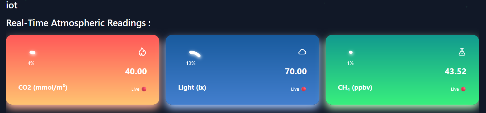

<div style="display: flex; justify-content: space-between; align-items: center;">
  
</div>


# Web Application – Setup & Documentation

This folder contains the web interface of the project, including both frontend and backend components. This guide will help you set up and understand the structure of the web application.

 
## 1. Overview  

The web application serves as the central interface for interacting with the system’s core services, providing users with access to real-time IoT data, quasi-real-time EO data and historical environmental insights. The architecture is composed of three interconnected blocks, each playing a critical role in the overall data flow and intelligence of the platform:

### 1.1.  User Interface

The user-facing module includes:

- Interactive Dashboard: Visualizes IoT sensor data, Earth observation insights, and predictive analytics.

- Forecasting Module: Displays AI-generated environmental predictions based on historical IoT/EO data.

- AI Chatbot: A conversational assistant that answers user queries.

### 1.2.  Backend Services

This layer orchestrates data processing, storage, and model inference through four key services:

- EO Data Processing: Extracts and analyzes satellite data to compute gas concentrations.

- IoT Data Pipeline: Receives and stores sensor data collected from physical devices deployed in the field.

- AI Prediction Model: Provides time series forecasting based on IoT and EO datasets.

- Chatbot Logic: Handles natural language queries by integrating contextual data and prediction results.

### 1.3.  Data Sources

The system is powered by two primary types of data inputs:

- IoT Sensors: Deployed in the field to collect environmental metrics such as temperature, gas concentrations, light, etc.

- Copernicus API: Supplies remote sensing data (e.g., Sentinel-2 imagery) used for Earth observation analysis.


The image below illustrates the high-level architecture connecting users, backend services, and data sources across the platform.

<p align="center"></p>


For a full view of module-level interactions, see [Section 7 – Detailed Architecture](#7-detailed-architecture) or check [Explanatory_Diagram](../Documents/Explanatory_Diagram.jpeg) (Zoom for better visibility).


---
## 2. Folder Structure

```bash
web/
├── backend/            # backend services
│   └── .env            # Environment config (to be created) 
│   └── .env.exemple    # Exemple of .env file (can be deleted ) 
├── frontend/           #  User interface         
├── docker-compose.yml   
└── README.md            

```

---
## 3. Setup Instructions  

This guide explains how to run the project using **Docker Compose**. Alternatively, you can use the manual setup process (requiring the use of requirements.txt and npm install). 

### Prerequisites

Ensure you have the following installed in your system:

- [Docker](https://www.docker.com/)
- [Docker Compose](https://docs.docker.com/compose/)

### Environment Variables

- Make a Copernicus account at : https://dataspace.copernicus.eu/
- Get an API KEY from : https://console.groq.com/keys
- For the IoT data source, you should have a running virtual machine with the ChirpStack installed on it
- Create a .env file & Change the corresponding variables in the file backend/.env :
```bash
# ========== COPERNICUS CREDENTIALS ============= #
COPERNICUS_USERNAME=<COPERNICUS_EMAIL>
COPERNICUS_PASSWORD=<COPERNICUS_PASSWORD>
# ========== AI API KEY ========================= #
GROQ_API_KEY=<API_KEY>

# ========== VIRTUAL MACHINE VARIABLES ========== #
MQTT_BROKER=<VIRTUAL_MACHINE_ADDRESS>
MQTT_PORT=<PORT_RUNNING_THE_SERVICE>
MQTT_TOPIC=<MQTT_TOPIC>
````

### Build the Docker Images & start the containers
```bash
docker-compose build
docker-compose up
```
And everything  will run fine ( no need for further configurations )

- The frontend will be available at http://localhost:5173
- The backend will run at http://localhost:8000 .
- You can modify the Dockerfiles and docker-compose.yml to suit your specific needs.

---


## 4. Backend Overview  

### 4.1. API
The api app serves the Singup, Signin Logic, the Chat Bot logic and the AI prediction logic:

#####  ChatBot
The application includes an AI-powered chatbot capable of two modes:
- **General Chat Mode**  
  The chatbot engages in natural conversation using a language model (LLaMA 3 via Groq). It uses previous messages to maintain context.
- **Analysis Mode**  
  When activated, users can upload CSV data (e.g., factory CO₂ levels), and the chatbot performs analysis such as:
  - Calculating average CO₂ levels  
  - Identifying the highest-emitting factory  
  - Warning if emissions exceed safe thresholds
 
The chatbot uses a carefully crafted default prompt to guide its responses based on CarbonSens project details and technical specs.

##### AI Gas Emission Prediction
This endpoint predicts gas concentration levels for the next 7 days based on recent measurements of the specified gas in the given region.

- **Parameters:**  
  - `gas`: The type of gas (e.g., CO, CH4)  
  - `region`: The target region name  

- **Response:**  
A JSON object with an array of predicted gas levels for the upcoming week.
### 4.2. data
The Data app serves the integration of Earth Observation (EO) data
#####  run_data.py script:
This script handles all the data logic as follows :
- **get_data Function:**
this function is located in backend/data/data/Sentinel_5p_Data_scripts/get_data.py which:
  - Defines Variables (username, password,nbr of images, area of interest ...)
  - Connects to COPERNICUS' Website
  - Gets EO Data and download .nc files (backend/data/data/data_sentinel_5p)
- **read_data Function:**
this function is located in backend/data/data/Sentinel_5p_Data_scripts/read_data.py which:
  - Reads .nc files
  - Converts .nc files to Pandas dataframe
  - Converts Pandas dataframe to CSV files (backend/data/data/CSV_data)
  - Plot the data to a map (for debugging) (backend/data/data/plot)
- **calculate_avg Function:**
this function is located in backend/data/data/calculate_avg.py which:
  - Reads CSV file
  - Calculates the average concentration of a given gas in a given Region
  
All of these functionalities are handled by run_data.py script. The script deletes all unnecessary files after use to improve scalability and resource efficiency..
  - For testing :
     ```bash
    cd backend/data/data
    python run_data.py
    ```
     and everything will be handled automatically
- **Web integration:**
  For web intergration every function is imported to views.py to handle requests using Django Rest FrameWork (DRF)
### 4.3. IoT
- **mqtt_listener Function:**
This script connects to an MQTT broker to receive IoT sensor data in real-time:
  - Connects and subscribes to a configured MQTT topic.
  - Listens for incoming messages containing sensor readings and device info.
  - Parses the JSON payload to extract environmental data (e.g., CH4, CO2, temperature, humidity) and GPS coordinates.
  - Saves the parsed data into the Django database.
  - **Web integration:**
  Then for web intergration the mqqt_listener function is imported to views.py to handle requests using DRF.

### 4.4. Dockerfile overview
Usage of multiple Dockerfile to run different components independently, all orchestrated using **Docker Compose** for seamless multi-container management.
- **Dockerfile:**
  - This Dockerfile handles the installation of dependencies, migrating the database, and starting the Django server on port 8000
- **cron.Dockerfile:**
  - This Dockerfile sets up a daily cron job to run the run_data.py script everyday at midnight, to keep the update of EO data Continious and Automatic
- **mqtt.Dockerfile:**
  - This Dockerfile runs the script mqtt_listener.py to keep getting realtime values and store them in the Database ~ Every 2 minutes

---
## 5. Frontend Overview  

The frontend provides a user-friendly interface featuring a data dashboard, AI-powered chatbot, and forecasting services. It combines clean UI and intuitive UX to help users easily interact with environmental data and insights.

### 5.1. How it works
  - Each backend service is accessed by the frontend through Django REST Framework (DRF), which manages JSON requests and responses. This enables the frontend to retrieve data and computations seamlessly, ensuring a user-friendly and intuitive experience.
### 5.2. SignIn & SignUp page
  - the user can only use the Services if he has an account.

  

### 5.3. Interactive Dashboard page
  - The dashboard features two gas emission services, EO and IoT, which users can switch between using the integrated button on the page.

   
   
   
  #### EO Data
  - There are 5 cards containing 5 gases (CO, NO2, CH4, O3, SO2) each card is clickable to expand and see the average concentration for each gas.
    
  <p align="center">
    
    
    
    
  </p>

  - Pie Chart to display the concentration of each gas together


  

  - Line Chart to display some gas concentration in the past years

  

  #### IoT Data
  - There are 3 cards containing (CO2, Light, CH4) each card is clickable to expand and see the average concentration.
  <p align="center">
    
    
    
  </p>
  
  - There is also  a table which contains more data collected by the IoT device (Temperature, Pressure, Humidity, Location (gps))
  - A small compliance note that helps meet environmental regulations and avoid health environmental risks

  
  
### 5.4. AI Assistance page
  -  The UI for the user to interact with the chatbot getting various information and getting help or analysis about a given data
  
   
   
### 5.5. Carbon Forcasting page
  -  A map to indicate if a region is predicted to be in danger or not
        
  
  
  -  A graph that contains the predicted values (using AI predictions) for the next week for each gas based on EO data
  -  Buttons to switch between each gas
    
  
  
### 5.6. Dockerfile
  - This Dockerfile handles the installation of dependencies, and starting the Web server on port 5173

## 6. Service orchestration with docker-compose

  - Docker Compose manages the build and execution of multiple services based on their respective Dockerfiles, including the backend, the frontend , mqtt_listener and a cronjob service that runs daily to collect data.
  - Manages networking, environment variables, and shared volumes across services.  
  - Simplifies startup with a single command: `docker-compose up --build`
---
## 7. Detailed Architecture
 
To complement the high-level overview above, the diagram below illustrates the internal modules, services, and communication between the frontend, backend, and data sources.

This diagram breaks down:
- Backend services  
- APIs and data flows
- Communication protocols between frontend, backend, and data sources


<p align="center"></p>
